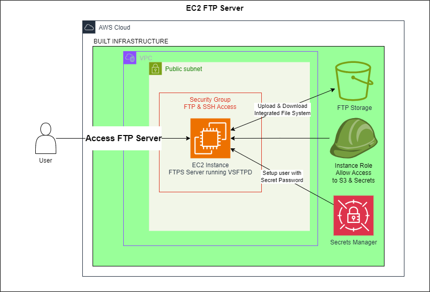

# Cheap & Easy AWS FTP Server with EC2 and S3

## Introduction

Using `AWS CDK` we can quickly deploy a small `EC2 Instance` to act as an
FTP Server with an unlimited S3 storage backend.

With an hourly rate of only `$0.0058` (us-east-1), `t2-nano` is sufficient for
running a small FTP server with the S3 integration!

The server is configured on deploy using [ec2 UserData](https://docs.aws.amazon.com/AWSEC2/latest/UserGuide/user-data.html).
[`mount-s3`](https://aws.amazon.com/s3/features/mountpoint/)
is used for mounting an S3 bucket to your instance. We start up [`VSFTPD`](https://help.ubuntu.com/community/vsftpd),
[set up a virtual user](https://docs.rockylinux.org/guides/file_sharing/secure_ftp_server_vsftpd/)
in the same directory as our mounted S3 bucket,
and we have our end-to-end FTP solution!

## Architecture

1. A user connects to the instance with the instance's public IP or DNS.
2. The user agrees to use the server's TLS certificate.
3. A secure FTPS connection is made and the user can freely work with the
   files on the S3 bucket.

## Method

[`AWS CDK`](https://aws.amazon.com/cdk/) is used to synthesize the
`CloudFormation` template that will deploy our architecture and
also configure the server.
